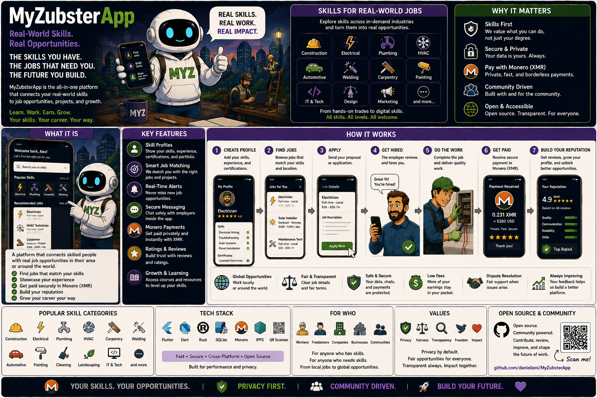

# MyZubster App

<p align="center">
  
</p>

> 🌍 **Understand MyZubster in your language:** [Global multilingual guide](https://github.com/MyZubster-Ecosystem/myzubster/blob/main/docs/i18n/README.md) — English, Italiano, Español, Français, Deutsch, Português, 中文, 日本語, 한국어, العربية, हिन्दी, Русский, Türkçe, Bahasa Indonesia, Polski, Українська, বাংলা, اردو, فارسی, Kiswahili.
>
> MyZubster connects real-world observations, verifiable evidence, collaborative bounties and platform rewards. **MYZ is currently an internal reward/accounting ledger; external XMR/token/blockchain settlement is separate and independently verified.**

React Native / Expo client for the MyZubster ecosystem.

## Status

**Development / active validation.** The app contains client flows for authentication, orders, payment QR/wallet-facing contracts and privacy/Orbot experiments. Backend capabilities must be verified against the configured Gateway before a UI flow is treated as operational.

## Development

```bash
npm ci
npx expo start
```

Configure the Gateway URL in `app.json` (`expo.extra.apiUrl`) or through `EXPO_PUBLIC_API_URL` where supported.

## Gateway contracts

The client uses Gateway API contracts for authentication/orders and wallet-facing operations. The wallet UI may expect endpoints such as:

| Method | Endpoint | Purpose |
|---|---|---|
| GET | `/api/wallet` | balance/current address |
| GET | `/api/wallet/transactions` | transaction history |
| POST | `/api/wallet/address` | create receive address |
| POST | `/api/wallet/transfer` | submit transfer request |

A client screen or API request does **not** prove that a real payment rail is available or that a transaction was externally settled. Gateway/verifier state is authoritative for external settlement.

## Native build

QR scanning/rendering and Orbot-related functionality may require a development/native build rather than Expo Go.

```bash
npx expo prebuild --clean
npx expo run:android
```

Starting Orbot alone is not proof that all application traffic is tunnelled through Tor. Proxy routing must be verified independently.

### Optional Tor Gateway transport

Direct HTTPS remains the default. To expose the opt-in Tor mode, configure a comma-separated list of approved `.onion` Gateway API roots through `EXPO_PUBLIC_TRUSTED_TOR_GATEWAY_URLS`, or set `expo.extra.trustedTorGatewayUrls` to an array. Endpoints containing credentials, query strings, fragments, or non-HTTP protocols are rejected.

When enabled, the client probes trusted endpoints without authentication data, selects the first healthy endpoint, uses a longer request timeout, and retries a network failure once only after another trusted endpoint passes its health check. If no trusted endpoint is healthy, it returns to the configured direct Gateway instead of sending credentials to an arbitrary endpoint. Transport choice does not alter Gateway authorization, jurisdiction capabilities, deep-link validation, or settlement verification.

Orbot installation or launch alone is not an anonymity guarantee. A native build must provide and independently verify the proxy path used for `.onion` traffic.

## Checks

```bash
npm test -- --runInBand
npx expo export --platform android --no-bytecode --output-dir /tmp/myzubster-export
```

A production Android release additionally requires a supported Android SDK/Gradle environment and correctly configured backend services.

## Bounties

Work in this repository may be associated with a MyZubster bounty only when the issue defines the deliverable, evidence, review and reward terms.

- [Canonical Bounty System](https://github.com/MyZubster-Ecosystem/myzubster/blob/main/BOUNTIES.md)
- [Ecosystem Architecture](https://github.com/MyZubster-Ecosystem/myzubster/blob/main/docs/ECOSYSTEM.md)

MYZ in the current core platform is an internal reward/accounting ledger. Issue closure or PR merge is not proof of an external XMR/token payment.

See `BOUNTIES.md` for repository-specific scope.

## Security and privacy

- Never store wallet seed phrases/private keys in AsyncStorage or source control.
- Treat authentication tokens as secrets.
- Do not represent testnet/simulation state as production settlement.
- Verify Tor/proxy behavior rather than inferring it from an installed/running app.

## Related projects

- [myzubster](https://github.com/MyZubster-Ecosystem/myzubster)
- [MyZubster Gateway](https://github.com/MyZubster-Ecosystem/MyZubsterGateway)
- [MyZubster Marketplace](https://github.com/MyZubster-Ecosystem/MyZubster-Marketplace)
- [myzubster-docs](https://github.com/MyZubster-Ecosystem/myzubster-docs)

## Transparency

Automation may assist with issue/PR/bounty workflows, but sensitive changes, bounty verification and settlement decisions require appropriate human/independent review.
